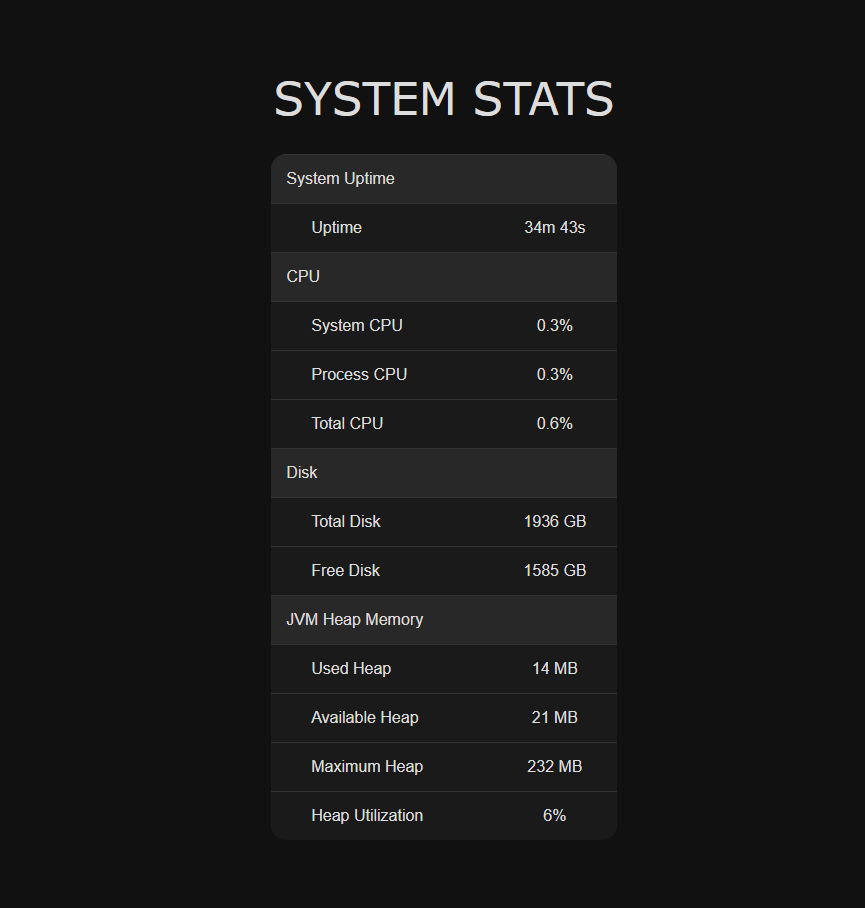

# Web Project - System Stats Dashboard 
(Work in Progress)

A simple Spring Boot web application that shows system statistics via a REST API and displays them on a web dashboard. This project is primarily for learning and experimentation with Java, Spring Boot, HTML, CSS, and JavaScript.

---

## Features

- **JVM Heap Memory**: Used heap memory, available heap, maximum heap, heap utilization
- **CPU Stats**: Process CPU load, system CPU load, total CPU load
- **Disk Stats**: Total and free disk space
- **Uptime**: JVM uptime in seconds
- **REST API**: Access each metric individually with `/api/stats/...` endpoints
- **Frontend Dashboard**: Display stats dynamically using JavaScript and APIs

---

## API Endpoints

### All Stats (json object)
- `GET /api/stats`

### Heap memory
- `GET /api/stats/jvmHeap/heapUsed` — Used heap memory (MB)
- `GET /api/stats/jvmHeap/heapAvailable` — Available heap memory (MB)
- `GET /api/stats/jvmHeap/heapMax` — Max heap memory (MB)
- `GET /api/stats/jvmHeap/heapUtilization` — Heap utilization (%)

### CPU
- `GET /api/stats/cpu/processCPU` — Process CPU load (%)
- `GET /api/stats/cpu/systemCPU` — System CPU load (%)
- `GET /api/stats/cpu/totalCPU` — Total CPU load (%)

### Disk
- `GET /api/stats/disk/totalSpace` — Total disk space (GB)
- `GET /api/stats/disk/freeSpace` — Free disk space (GB)

### Uptime
- `GET /api/stats/uptime` — JVM uptime (seconds)

---

This site can be reached at https://webproj-production.up.railway.app/

